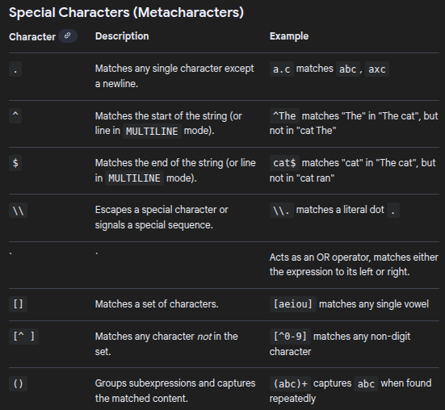
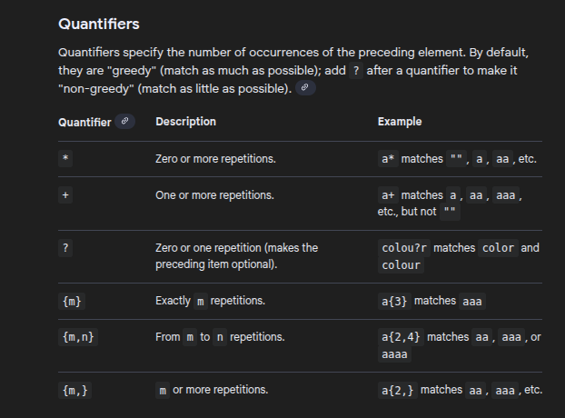
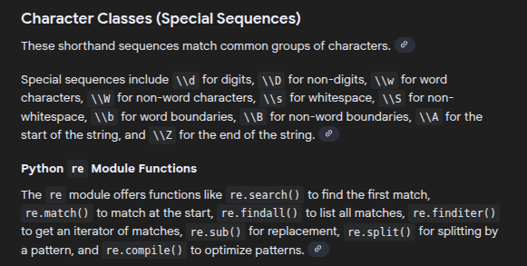

# Regular Expressions (often shortened to **RegEx**)
  are essentially a powerful "search-and-replace" engine on steroids. While a normal search looks for a specific word, RegEx looks for **patterns**.

__Think of it like this__: A normal search looks for "John." A RegEx search looks for "any word that starts with an uppercase letter, is followed by 3 lowercase letters, and ends with a vowel."

In Python, we use the built-in `re` module to handle these patterns.

---

## 🛠️ The RegEx "Cheat Sheet" (Common Symbols)

To use RegEx, you need to learn its special language. Here are the most common characters:

| Symbol | Meaning | Example |
| --- | --- | --- |
| **`.`** | Any single character (except newline) | `a.c` matches "abc", "a1c" |
| **`\d`** | Any digit (0-9) | `\d\d` matches "42", "07" |
| **`\w`** | Any alphanumeric character (a-z, A-Z, 0-9, _) | `\w+` matches "Hello_123" |
| **`+`** | One or more of the preceding character | `a+` matches "a", "aaa" |
| **`*`** | Zero or more of the preceding character | `a*` matches "", "a", "aaa" |
| **`^`** | Starts with | `^Hello` |
| **`$`** | Ends with | `world$` |
| **`[a-z]`** | Any character within the brackets | `[A-Z]` matches any uppercase letter |

---

##  Python's `re` Module Functions

| Function | What it does |
| --- | --- |
| **`re.search()`** | Scans the whole string for the **first** location where the pattern matches. |
| **`re.findall()`** | Returns a **list** of all matches in the string. |
| **`re.sub()`** | **Replaces** the matches with a string of your choice. |
| **`re.split()`** | Splits the string into a list wherever the pattern occurs. |

---

##  Real-Life Examples

### 1. Validating an Email Address

Checking if a user entered a valid email is the most common use case.

```python
import re

email_pattern = r"^[a-zA-Z0-9._%+-]+@[a-zA-Z0-9.-]+\.[a-zA-Z]{2,}$"

def validate_email(email):
    if re.match(email_pattern, email):
        print(f" {email} is valid!")
    else:
        print(f" {email} is invalid!")

validate_email("user.name@company.org") # Valid
validate_email("bad-email@com")          # Invalid

```

### 2. Extracting Phone Numbers from Text

Imagine you have a big messy document and you need to pull out every phone number formatted like `(123) 456-7890`.

```python
text = "Contact us at (555) 123-4567 or our support line at (800) 555-0199."

# \(\d{3}\) -> matches (3 digits)
# \s        -> matches a space
# \d{3}-\d{4} -> matches 3 digits, a dash, then 4 digits
phone_pattern = r"\(\d{3}\)\s\d{3}-\d{4}"

numbers = re.findall(phone_pattern, text)
print(f"Extracted Numbers: {numbers}")

```

### 3. Cleaning Data (Removing Special Characters)

If you are doing Data Science or AI, you often need to "clean" text by removing everything that isn't a letter or a number.

```python
dirty_text = "Wait! Why is there #so #much $junk in this %string???"

# [^a-zA-Z0-9\s] means: match anything that is NOT a letter, number, or space
clean_text = re.sub(r"[^a-zA-Z0-9\s]", "", dirty_text)

print(f"Cleaned: {clean_text}")
# Output: Wait Why is there so much junk in this string

```

---

##  Developers Use RegEx

1. **Input Validation:** Ensuring passwords have a capital letter, a number, and a symbol.
2. **Log Parsing:** Scanning thousands of lines of server logs to find specific error codes (like `404` or `500`).
3. **Web Scraping:** Finding specific patterns (like prices or product codes) in HTML code.
4. **Refactoring Code:** Using RegEx in your code editor (like VS Code) to rename variables or change patterns across hundreds of files at once.

### Important: Raw Strings (`r""`)

In Python, always put an `r` before your RegEx pattern (e.g., `r"\d+"`). This tells Python it's a **Raw String**, so it doesn't try to interpret backslashes (`\`) as special Python characters (like `\n` for newline).


---
---

Here is a cheat sheet for regular expressions in Python using the built-in re module. It covers common syntax elements and module functions for matching and manipulating strings. Using raw strings (prefixing the pattern string with r, e.g., r"\d+") is highly recommended to avoid issues with backslash escapes being interpreted by Python's string literals. 



---
---



---
---


---
---
