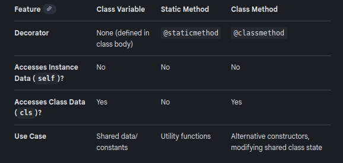

# Types of Methods in Python 
Here we have 3 types of methods in python related to object orientation programming .   
- ### Instance Method
    - Instance method just like simple method , which belong to each instance of that class object .   
    - With instance/ object spacific attributes memeory
    - having ability to access the attributes with __slef.__ keyword   
    
-  ### Class Method
    - Class method define using the **@classmethod** decorator
    - class method can be called Without iniateing the object of that class 
    - Having ability to access the class attributes and other class methods
    - not able to manipulate the instace attributes
- ### Static Method
    - Creating using the ***@staticmethod*** decorator 
    - These method can also be called With class name 
    - They are self-contained methods, meaning they cannot access any other attributs or call any other methods within the class
    - not having explict self or cls keywords

# 

## Declaring Static Variables (Class Variables)
variables that are shared by all instances of a class are called class variables. They are defined directly within the class body, but outside of any method (including __init__)
